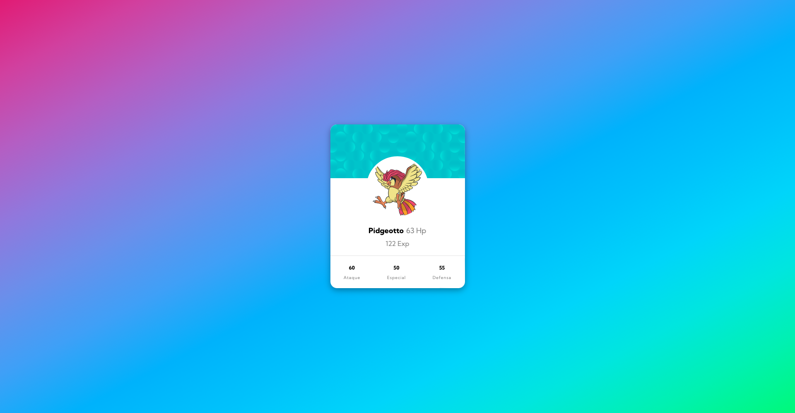

# Pokemon card

## Table of contents

- [Overview](#overview)
  - [The challenge](#the-challenge)
  - [Screenshot](#screenshot)
  - [Links](#links)
- [My process](#my-process)
  - [Built with](#built-with)
  - [Useful resources](#useful-resources)
- [Author](#author)

## Overview

### The challenge

- Build out the project to the designs provided

### Screenshot

### Links

- Solution URL: [Solution URL]()
- Live Site URL: [Live site URL]()

## My process

### Built with

- Semantic HTML5 markup
- SASS and CSS custom properties
- Flexbox

### Useful resources

- [Flexbox](https://css-tricks.com/snippets/css/a-guide-to-flexbox/) - A Complete Guide to Flexbox
- [Color HSL](https://developer.mozilla.org/es/docs/Web/CSS/color_value) -  HSL cylindrical-coordinate
- [Normalize.css](https://necolas.github.io/normalize.css/) -  A modern, HTML5-ready alternative to CSS resets
- [Sass Basics](https://sass-lang.com/guide/) - Learn Sass
- [Math Random](https://developer.mozilla.org/es/docs/Web/JavaScript/Reference/Global_Objects/Math/random) - Math.random()  

- [Async Await](https://developer.mozilla.org/es/docs/Web/JavaScript/Reference/Statements/async_function) - Función async
- [Fetch](https://developer.mozilla.org/es/docs/Web/API/Fetch_API/Using_Fetch) - Uso de Fetch
- [DOMContentLoaded](https://developer.mozilla.org/en-US/docs/Web/API/Window/DOMContentLoaded_event) - Window: DOMContentLoaded event
- [Fragment](https://developer.mozilla.org/es/docs/Web/API/Document/createDocumentFragment) - Document.createDocumentFragment()

## Author

- Github - [Renzo Alessandro Sucari Velásquez](https://github.com/RenzoAlessandro/)
- Frontend Mentor - [@RenzoAlessandro](https://www.frontendmentor.io/profile/RenzoAlessandro)
